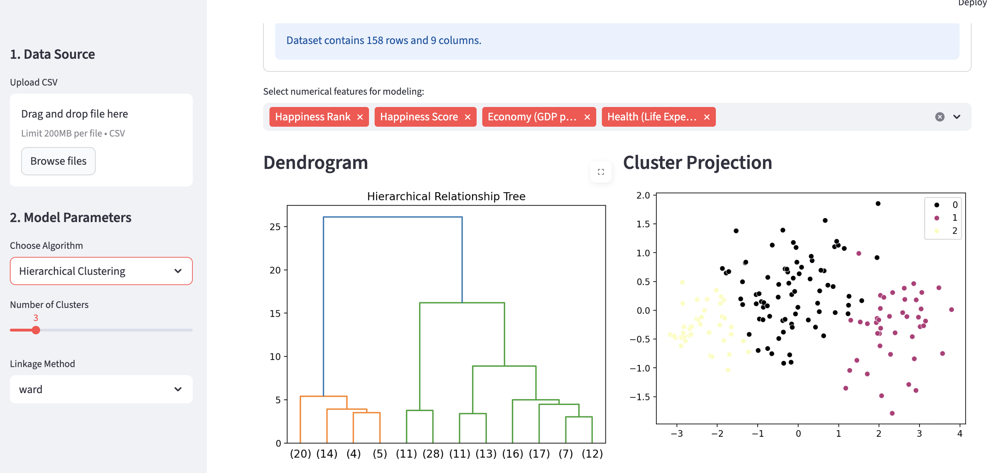

# Unsupervised ML Modeling on Streamlit
This interactive Streamlit web application is intended to explore clustering and dimensionality reduction algorithms. It allows users to view the default dataset or upload their own datasets and visualize how different machine learning models group data and reduce complexity live.

### TLDR:
An interactive dashboard built with **Streamlit** and **Scikit-Learn**. It automates data scaling and provides interactive visualizations for **K-Means**, **Hierarchical Clustering**, and **PCA**, using the World Happiness dataset as a default benchmark or users personal datasets.

# Unsupervised Machine Learning Explorer



Featured here is the Hierarchial Clustering models of the default dataset.

## Description:
My Unsupervised ML Modeler is an interactive web application built with Streamlit that enables the process of discovering hidden structures within datasets by automating preprocessing and scaling. The page defaults to a dataset featuring world happiness rankings or provides the opportunity for users to upload their own datasets. Based on the dataset, it includes visualizations of hierarchical clustering, PCA, and K-means, allowing users to easily pivot between the different structures with live updates to the models. This unsupervised machine learning modeling system transforms high-dimensional raw information into understandable visualizations, making it a powerful tool for customer segmentation to anomaly detection.

## Key Features & Algorithm Explanations:
* **Dynamic Data Ingestion:** Supports real-time CSV uploads with automated numerical feature detection and cleaning.
* **K-Means Clustering:** Implements centroid-based partitioning with an integrated **Elbow Method** plot to identify the optimal cluster count ($k$).
* **Hierarchical Clustering:** Provides an agglomerative approach visualized through a **Dendrogram**, allowing users to see the nested relationship between data points.
* **Principal Component Analysis (PCA):** Reduces high-dimensional data into a 2D projection, maximizing the "Explained Variance" for easier visual pattern recognition.
* **In-App Documentation:** Includes expandable technical blurbs explaining Silhouette Scores, Inertia, and Linkage methods.

## Skills & Technologies Used:
* **Page Framework:** Streamlit (Layouts, Sidebars, Widgets)
* **Machine Learning:** Scikit-Learn (KMeans, AgglomerativeClustering, PCA, StandardScaler)
* **Data Manipulation:** Pandas, NumPy
* **Visualization:** Matplotlib, Seaborn, Scipy (Dendrograms)
* **Evaluation Metrics:** Silhouette Score, Inertia (Elbow Method), Explained Variance 

## Local Setup & Execution:
1. **Clone the repository:**
   ```bash
   git clone (https://github.com/megnash14/Nash-Data-Science-Portfolio.git)
   cd Nash-Data-Science-Portfolio/MLUnsupervisedApp
2. **Install Dependencies:**
Ensure you have Python installed, then run the following command to install the required libraries
     ```bash
    pip install streamlit pandas numpy matplotlib seaborn scikit-learn scipy
3. **Run the Application:**
    Execute the Streamlit command to launch the dashboard in your local browser:
     ```bash
    streamlit run app.py

Streamlit Link:
(https://megnash14-nash-data-science-portfol-mlunsupervisedappapp-j1tzbg.streamlit.app/)

Dataset Link:
(https://www.kaggle.com/datasets/hassanali789/world-happiness-report-2026-official-rankings)

My Repository Link:
(https://github.com/megnash14/Nash-Data-Science-Portfolio/tree/main)

