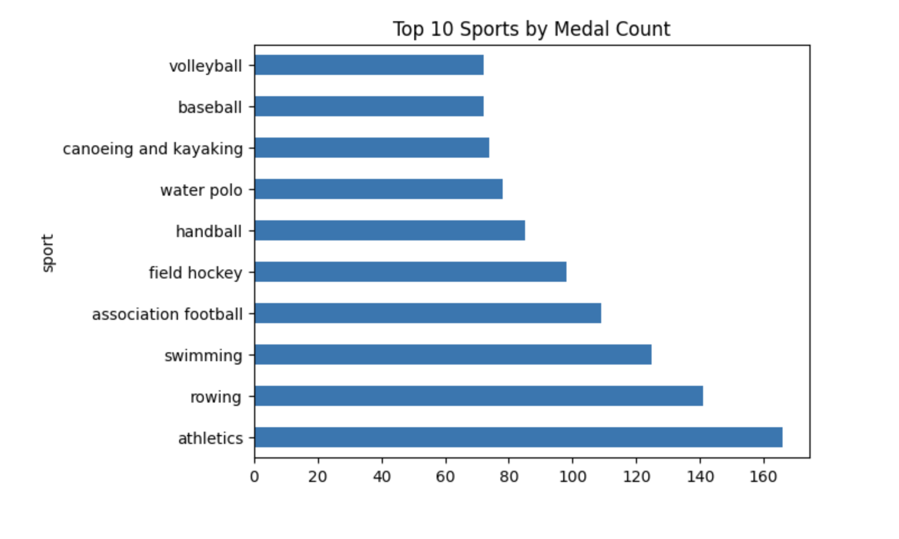
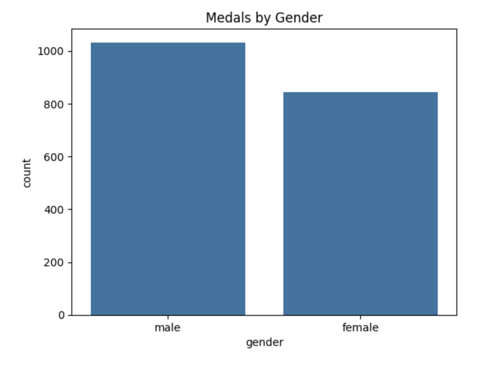

# Project Overview: Describe the goal of your project and provide a brief explanation of tidy data principles.
* The goal of this project was to apply tidy data principles to a real data set. In its original form it was in "wide format" where different variables were listed into the column headers. I was aiming to restructure it for easier analysis and visualization.
# Instructions: Include step-by-step instructions on how to run the notebook, along with dependencies (e.g., pandas, matplotlib, etc.).
* To run this project, you need to have python installed with libraries including pandas, matplotlib, and seaborn. They can download these using pip install pandas matplotlib seaborn. 
# Dataset Description: Outline the source of your data and any pre-processing steps.
* The dataset I used for this project is 2008 Summer Olympics, all medalists, not by country but by place of birth. This dataset was originally designed to analyze olympic success based on the NUTS(Nomenclature of Territorial Units for Statistics) where athletes were born, rather than just their national team. My pre-processing steps including just looking at what data was included in each column and how they rows and columns were headed. I then used pd.melt to collapse the dozens fo columns into two which were for the category and the medal type. After that, I used str.split to seperate the gender and sport into their own individual columns. Finally, I filtered out the empty entries using str.strip to ensure that the sport column was prepped for grouping.  
# References: Provide links to the cheat sheet and tidy data paper for further reading.
* Olympics Dataset: https://edjnet.github.io/OlympicsGoNUTS/2008/
*Pandas Cheat Sheet: https://pandas.pydata.org/Pandas_Cheat_Sheet.pdf
*Tidy Data Paper: https://vita.had.co.nz/papers/tidy-data.pdf
# Visual Examples: Consider adding screenshots of your visualizations or code snippets.
* 
* 